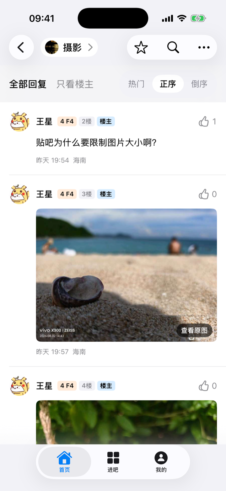

# TiebaPure-iOS

[](https://github.com/infinityf4p/TiebaPure-iOS/actions/workflows/ci.yml?query=branch%3Amain)
[](LICENSE)
[](https://github.com/infinityf4p/TiebaPure-iOS/releases/latest)

基于 SwiftUI 的第三方百度贴吧客户端，支持 iOS 18.0 及更高版本。

## 截图

<p align="center">
  
  
  
</p>

<p align="center"><sub>未登录访客模式下的公开内容</sub></p>

## 功能

**浏览**（无需登录）

- 首页推荐、进吧、吧内列表，「最新 / 精华」分类，可按回复时间或发帖时间排序
- 搜索主题与回复，吧内搜索
- 帖子详情、楼中楼、图片缩放与保存、视频播放

**登录后**

- 消息：回复我的、@我的
- 关注或取消关注用户、贴吧，查看关注与粉丝列表
- 主贴、楼层、楼中楼点赞
- 发布文字主题，回复帖子、楼层与楼中楼；回复支持最多 9 张图片，编辑器支持贴吧表情和本机草稿

**本机功能**

- 关键词 / 用户 / 贴吧屏蔽
- 浏览历史与帖子收藏支持搜索、筛选和批量管理；阅读位置自动恢复，各上限 500 条
- iPad 双栏布局，外观可跟随系统或手动选择浅色 / 深色，支持「减弱动态效果」
- 深链接 `tiebapure://thread/...`、`tiebapure://forum/...`，以及 Safari 分享菜单中的「用 TiebaPure 打开」

发布与回复使用非官方实验接口，首次使用会显示风险说明。发送结果无法确认时不会自动重发，避免重复发布；个人资料编辑暂时不提供。

## 隐私

项目不设自建后端，也不包含广告、统计分析或遥测 SDK。登录凭证仅保存在 Keychain；浏览历史、收藏、阅读位置、搜索历史和屏蔽规则仅保存在本机。使用应用时，会直接连接百度贴吧及相关内容资源服务。

## 下载

[Releases](https://github.com/infinityf4p/TiebaPure-iOS/releases/latest) 提供已发布版本的 **未签名** IPA，功能可能落后于 `main`，安装前需要使用自己的证书重新签名。

## 构建

已验证的开发环境为 Xcode 26.6、iOS 26.5 模拟器和 XcodeGen 2.45.x；App 最低支持 iOS 18.0。

```bash
xcodegen generate --spec project.yml
```

```bash
xcodebuild -project TiebaPure.xcodeproj -scheme TiebaPure \
  -destination 'platform=iOS Simulator,name=iPhone 17,OS=26.5' build
```

## 开源许可

TiebaPure-iOS 以 [GPL-3.0-only](LICENSE) 发布，不提供任何担保。项目使用的 [SwiftProtobuf](https://github.com/apple/swift-protobuf) 采用 [Apache-2.0 许可证及 Runtime Library Exception](LICENSES/SwiftProtobuf-Apache-2.0.txt)。

## 声明

本项目与百度公司、百度贴吧官方无隶属、授权或认可关系。

“百度”“贴吧”及相关名称与标识归其各自权利人所有。

## 感谢

感谢 [TiebaLite](https://github.com/HuanCheng65/TiebaLite) 为项目早期开发提供参考，也感谢 [aiotieba](https://github.com/lumina37/aiotieba) 对贴吧协议的整理与开源实现。
